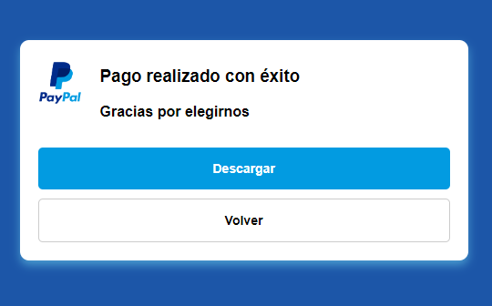

## 01 - Menu básico responsive burguer

## 02 - Imagenes apiladas sin fondo

## 03 - Barra de busqueda

## 04 - Pago confirmado

## 05 - Tarjeta pokémon

## 06 - Menu con animación

## 07- KeyFrame

## 08 - Card Zapatos

## 09 - Lista de personajes

## 10 - Hover personajes

## 11 - Login

## 12 - Movimiento ondas

## 13 - Cards con desplazamiento

## 14 - Iluminación texto

## 15 - Card rotación 3D

## 16 - Expandir preguntas

